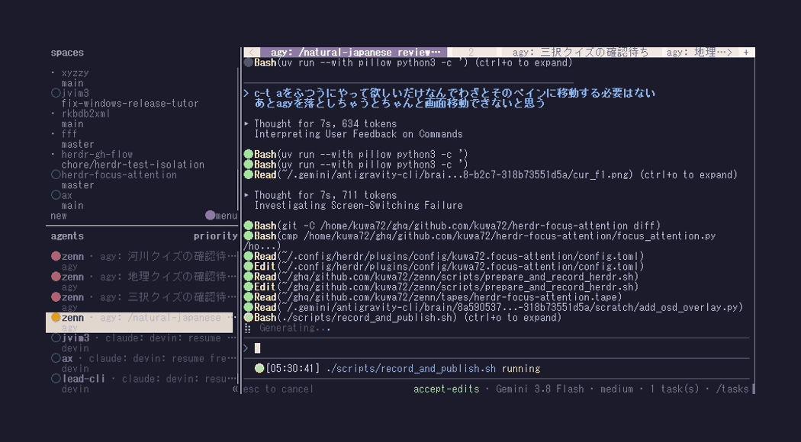

# herdr-focus-attention（中文）

在需要处理的 Agent 之间前后跳转的 Herdr 插件。

按状态优先级排序（默认为 `blocked` > `done` > `idle`），
相同状态内按状态变化时间从新到旧排序。
如果当前查看的 Agent 在队列中，则跳到它的下一个（或上一个），
连续按键即可轮询所有需要处理的 Agent。
没有需要处理的 Agent 时会弹出 toast 提示，不会静默失败。

[English](README.md) | [日本語](README.ja.md) | [中文](README.zh-CN.md)



## 安装

```bash
herdr plugin install kuwa72/herdr-focus-attention
```

需要 `PATH` 中有 Python 3.11 或更高版本，可用 `python3` 调用（仅使用标准库）。
Windows 11 可直接使用 `python3` 应用执行别名；如果不可用，
请从 python.org 或应用商店安装 Python，并确保能解析到 `python3`。

## 快捷键

快捷键由 Herdr 管理，请在 `~/.config/herdr/config.toml` 中绑定：

```toml
[[keys.command]]
key = "prefix+a"
type = "plugin_action"
command = "kuwa72.focus-attention.next"
description = "跳转到下一个需要处理的 Agent"

[[keys.command]]
key = "prefix+shift+a"
type = "plugin_action"
command = "kuwa72.focus-attention.prev"
description = "返回上一个需要处理的 Agent"
```

然后生效：

```bash
herdr server reload-config
```

`f9`、`f10` 等功能键也可以不经过前缀直接绑定。
与可打印按键不同，功能键不会拦截文字输入，按一下即可触发。

```toml
[[keys.command]]
key = "f9"
type = "plugin_action"
command = "kuwa72.focus-attention.next"
description = "跳转到下一个需要处理的 Agent"

[[keys.command]]
key = "shift+f9"  # 也可以用 "f10"
type = "plugin_action"
command = "kuwa72.focus-attention.prev"
description = "返回上一个需要处理的 Agent"
```

## 配置

首次运行时，插件会在其配置目录下生成 `config.toml`。查看路径：

```bash
herdr plugin config-dir kuwa72.focus-attention
```

```toml
# 视为“需要处理”的 Agent 状态，写在前面的优先。
# 未列出的状态不会跳转。
# 可选值: blocked, done, working, idle, unknown
priority = ["blocked", "done", "idle"]

# "all" = 查看所有工作区；"workspace" = 仅查看当前工作区
scope = "all"
```

配置每次调用时都会读取，无需重新加载。

## 故障排查

```bash
herdr plugin action invoke kuwa72.focus-attention.next
herdr plugin log list --plugin kuwa72.focus-attention
```

## 许可证

0BSD — 参见 [LICENSE](LICENSE)。
